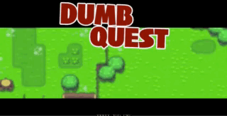

# DumbQuest

*This project was made during my year of study at UHA 2019*

## Description

Dumbquest is a little ZeldakLike project made with **JavaFx**.

*All the students have chosen their own game concept*

The game contains :
- One level
- Five area
- Three diffentes types of ennemies
- One Boss (beat him to win the party)

This game was made to practice :
* JavaFx
* MVC
* Object Heritage
* Path Finding Algorithm

## Menu

## Game
A quick in game view sample :

